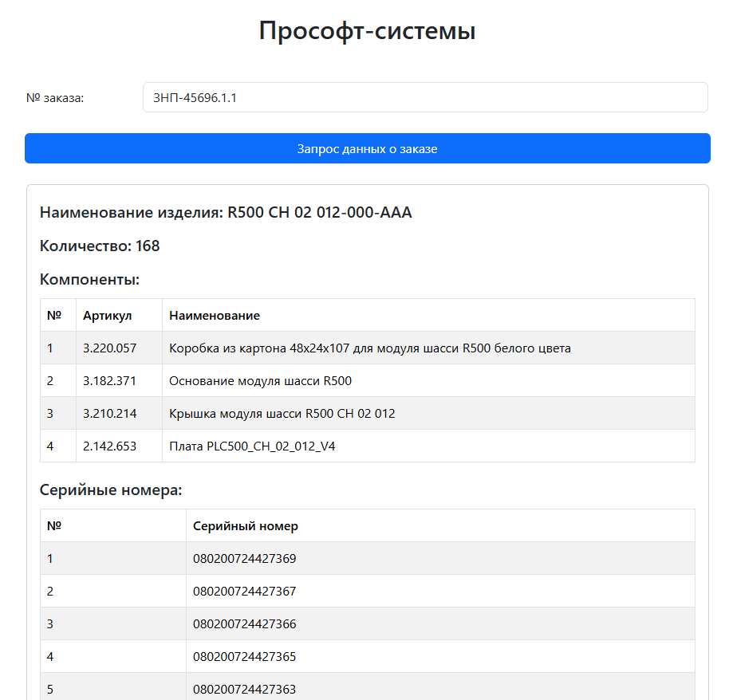
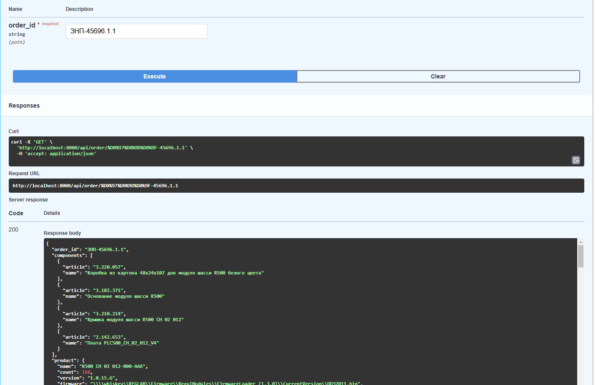

# OrderDataViewer

Приложение позволяющее получить и визуализировать информацию по номеру заказа; 
Приложение реализованно двумя сервисами: 

1) backend (python/fastapi)
2) frontend (js/react)

### Подготовка перемен окружения

Для скрытия чувтствительных данных заполняем .env файл на эксплуатирумой машине

Создадим .env по прообразу:

linux:
```bash
cp .env.example .env
```
windows:
```commandline
COPY .env.example .env
```

И доступным способом редактируем .env файл заполняя/редактируя значения переменных 

### Запуск

```bash
docker compose up -d
```

### Адреса сервисов

http://localhost:3000 - Графический интерфейс предоставления информации



http://localhost:8000/docs - Swagger описание реализованного api, возможность использовать api из вкладки бразуера  



## Структура проекта

### backend

[domain](backend%2Fdomain) - Модели данных/интерфейсы, определяющие бизнес-логику

[routers](backend%2Frouters) - Описание точек входа / правила формирование swagger документации

[infrastructure](backend%2Finfrastructure) - Реализация взаимодействия с внешними системами 

[use_cases](backend%2Fuse_cases) - Реализация бизнес-логики


## TODO
- [x] Реализация backend  
- [x] Реализация frontend 
- [x] Внедрение docker/docker compose 
- [x] Вынос чувствительных данных в .env 
- [ ] unittest'ы
